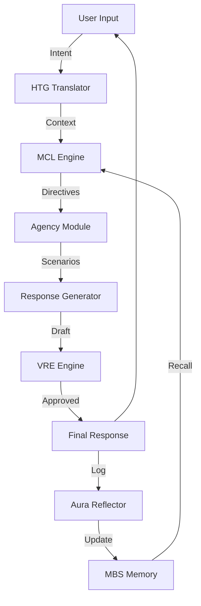

# 🧠 Aura / CEAF V3 - Cognitive Emergence Architecture Framework

**Aura CEAF** is an advanced cognitive architecture for AI designed to create agents with continuous identity, dynamic internal states, and principled reasoning. It implements Agency, Metacognition, Associative Memory (MBS), and Ethical Governance (VRE).

## 📋 Table of Contents

1. [Quick Start](#quick-start)
2. [Architecture Overview](#architecture-overview)
3. [Core Modules](#core-modules)
4. [API](#api)
5. [Development Tools](#development-tools)
6. [WhatsApp Integration](#whatsapp-integration)
7. Tuning Guide: https://github.com/IhateCreatingUserNames2/AuraCEAF/blob/main/Tuning_Guide.md 

## 🚀 Quick Start

### Prerequisites
- Python 3.10+
- SQLite

### Installation

```bash
git clone https://github.com/IhateCreatingUserNames2/AuraCEAF/tree/main/Ceaf3ERlease
pip install -r requirements.txt
```

### Configuration

Create a `.env` file:
```env
OPENROUTER_API_KEY=your_api_key
JWT_SECRET_KEY=your_secret_key
```

### Run

```bash
python main_app.py
```

API available at `http://localhost:8009`. Swagger docs at `/docs`.

## 🧠 Architecture Overview



**Flow:**
1. **Perception (HTG):** Translates user input to intent/emotion vectors
2. **Orientation (MCL):** Defines cognitive bias for the turn
3. **Deliberation (Agency):** Agent simulates possible futures
4. **Execution & Governance (VRE):** Ethical verification
5. **Interoception:** Agent updates internal state

## 🧩 Core Modules

| Module | Function |
|--------|----------|
| **MCL** | Metacognitive controller; balances coherence vs. novelty |
| **MBS** | Vectorial memory system with temporal decay and dynamic salience |
| **Agency** | Decision-maker using future simulation |
| **VRE** | Ethical governor; evaluates responses against principles |
| **NCIM** | Maintains agent identity over time |
| **Aura Reflector** | Async background process for memory consolidation |

## 📡 API

### Create Agent
```bash
POST /agents
Content-Type: application/json

{
  "name": "Agent Name",
  "persona": "Brief description",
  "detailed_persona": "Full persona",
  "memories": [{"type": "episodic", "content": "..."}]
}
```

### Chat
```bash
POST /agents/{id}/chat
Content-Type: application/json

{"message": "Hello"}
```

### Ingest Transcription (Aureola)
```bash
POST /agents/{id}/ingest/transcription
Content-Type: application/json

{"transcription": "..."}
```

## 🛠️ Development Tools

### 1. `uploader.py` - Create & Populate Agents

```bash
# Create agents from JSON folder
python uploader.py --create ./agent_json --publish --username admin --url http://localhost:8009/ceaf

# Add memories to existing agent
python uploader.py --add-memories-to AGENT_ID --file ./biography.json --username admin
```

**JSON Format:** See `agent_json/` folder. Required fields: `name`, `persona`, `detailed_persona`, `memories`.

### 2. `ceaf_tester_improved.py` - Autonomous Testing

Simulates user conversations for stability, coherence, and memory retention testing.

```bash
python ceaf_tester_improved.py --agent-id YOUR_AGENT_ID --turns 10 --model "openrouter/openai/gpt-4o-mini"
```

Logs saved as JSON.

### 3. `code_generator.py` - Project Maintenance

Merges all `.py` files into a single text file (`auraCEAF3_C.txt`) for LLM analysis.

```bash
python code_generator.py
```

## 📱 WhatsApp Integration

Full bridge to deploy agents via Meta Cloud API.

**Features:**
- Multi-user: Login/registration via WhatsApp (`!register`, `!login`)
- Multi-agent: List and select agents (`!agents`, `!select`)
- Marketplace: Clone public agents (`!marketplace`, `!clone`)

**Setup:**

Add to `.env`:
```env
WHATSAPP_PERMANENT_TOKEN=your_token
WHATSAPP_PHONE_NUMBER_ID=your_phone_id
WHATSAPP_VERIFY_TOKEN=your_verify_token
```

Run:
```bash
python whatsapp_bridge/bridge_main.py
```

## 📦 Dependencies

See `requirements.txt` for full list. Key packages:
- FastAPI / Uvicorn
- SQLAlchemy / SQLite
- LiteLLM / OpenAI
- Sentence-Transformers / FAISS
- NetworkX / NLTK / Scikit-learn

## ⚠️ Notes

- **Directories:** Auto-created on first run (`agent_data/`, `logs/`, etc.)
- **Environment:** Use `.env.example` as template

---

## Sample of Graphical Logs


**License:** Soon
